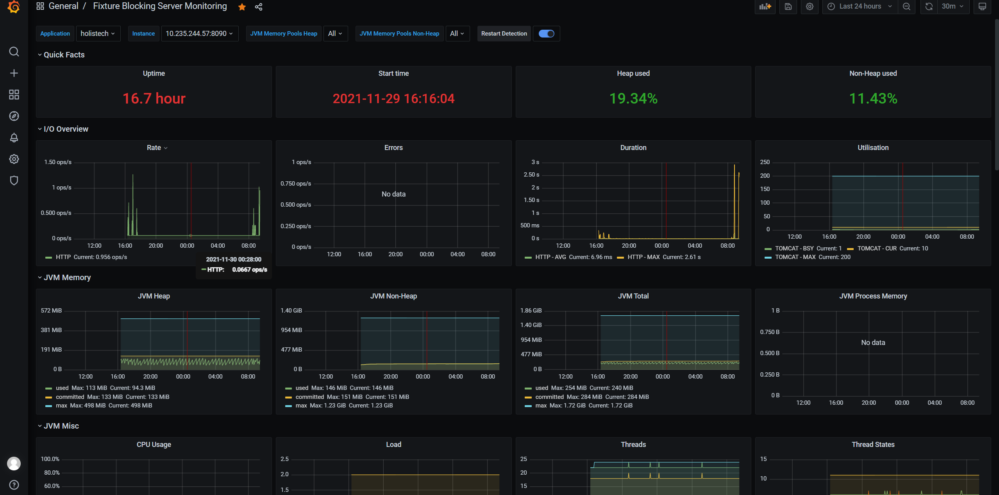

# Holistech

## Bussines requirements
There is a business need to have systemic possibility to block fixture on production floor.

## Project requirements
- [x] as a user with role TESTER/QUALITY/USER  I would like to log in to be able to block fixture in FIS
- [x] as a user with role TESTER/QUALITY/USER I would like to have recorded fixture status change or name  in history log and email
- [x] as a user with role TESTER/QUALITY/USER  I would like to see history log
- [x] as a user with role TESTER/QUALITY/USER  I would like to see fixture status
- [x] as a user with role TESTER/QUALITY/USER I would like to log in to be able to see status of fixture
- [x] as a user with role TESTER/QUALITY/USER I would like to have possibilities to choose languages Polski|English|Deutsch|Pyсский
- [x] as a user with role TESTER/QUALITY/USER I would like to use API for this
- [x] as a user with role TESTER/QUALITY/USER I would like to have 
- [x] as a user with role TESTER  I would like to login to be able as the only one to create new fixture (name and Type(ICT,SMT_MOL))
- [x] as a user with role QUALITY I would like to login to be able as the only one to unlock fixture in FIS

## Solution 

### FIS response
- DEBUG **** [120697] 11/30/2021 08:47:21 **** ei_svr.svr (ei_machine431) Launching application (/fis/mantis/custom/apps/local/EI/fixture_interface.tcl)
- DEBUG ( 0) [20697] 11/30/2021 08:47:21 Starting Application
- DEBUG ( 0) [20697] 11/30/2021 08:47:21 Client IP: 10.235.244.57
- DEBUG ( 0) [20697] 11/30/2021 08:47:21 Incoming Message: <ADDFIXTURE|process=ICT|fixture=1954|status=PASS>
- DEBUG ( 0) [20697] 11/30/2021 08:47:21 Sending reply: PASS
- DEBUG ( 0) [20697] 11/30/2021 08:47:21 Done Processing Data
- DEBUG ( 0) [20697] 11/30/2021 08:47:21 Ending Application
### OpenPoints
- [x] FIS
- [x] email
- [x] Locale i18n
- [x] Profiles (dev(H2),prod)
- [x] Inputs validation (frontend/backend)
- [x] Suggestion for inputs (SetOK,SetNOK,FixtureName)
- [x] Patterns for inputs (SetOK,SetNOK,FixtureName) 
- [x] Transfer inputs  to capital letters 
- [ ] Tests -> ongoing
- [X] REST API with Swagger UI
- [x] log history
- [x] healthChecks metrics, prometheus, Grafana
- [x] Docker
- [ ] Holistech email -> canceled due to the IT Security  
- [ ] Holistech API -> waiting for IT feedback

### Used Technologies 
- SpringBoot (Spring Data, Spring Security)
- Thymeleaf with Bootstrap
- Swagger UI
- Grafana
- Docker-Compose

## Info
### new jar creation
- mvn clean package spring-boot::repackage 
- java -jar holistech.jar
### docker
- docker-compose -f "/Volumes/RAM Disk/holistech/docker-compose.yml" up -d
### links
- app    -> http://eoltserverprod:8090/fixtures
- API    -> http://eoltserverprod:8090/swagger-ui.html
- metrics-> http://eoltserverprod:8090/actuator
- prometheus -> http://eoltserverprod:9090
- http://eoltserverprod:3000 -> grafana (login:admin pass:admin) ; url http://prometheus:9090; import jvm Micrometer ID 4701
### metrics
- http_server_requests_seconds_count
- http_server_requests_seconds_sum
- hikaricp_connections_usage_seconds_count
- hikaricp_connections
### obsolete
- old -> docker pull prom/prometheus, docker run -p 9090:9090 prom/prometheus, localhost:9090,
- old -> docker pull grafana/grafana, docker run -p 3000:3000 grafana/grafana  haslo:admin pass:admin, add datasource prometheus,go inside prometheus container,inside contener ifconfig ->eth0 172.17.0.2:9090

