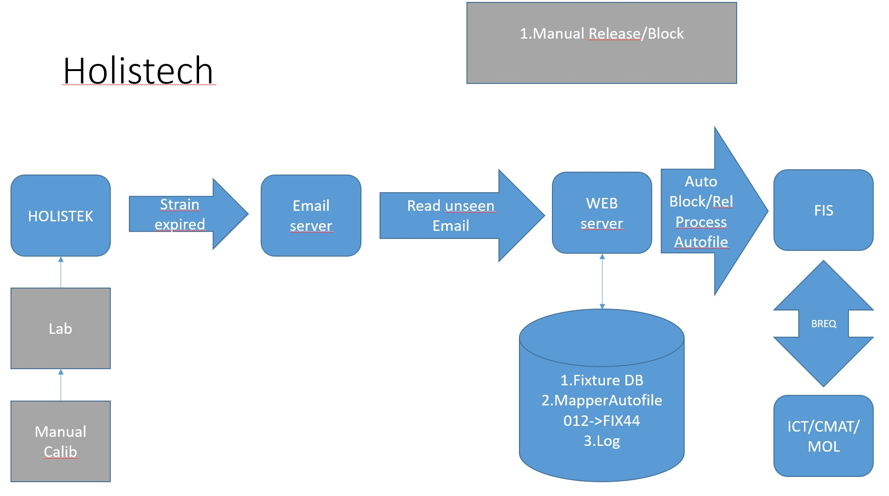
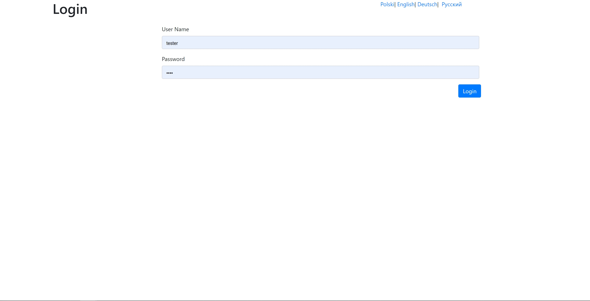
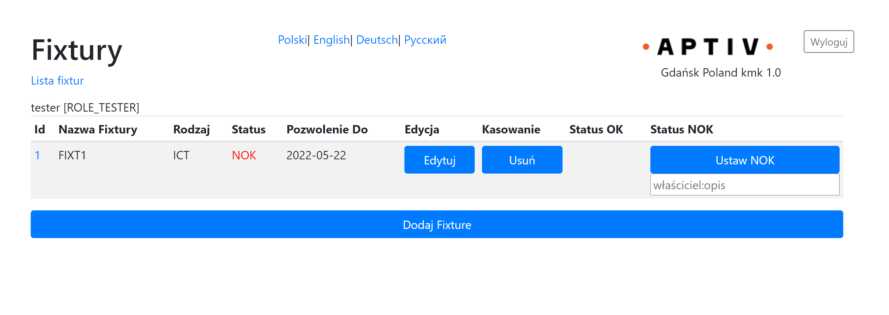
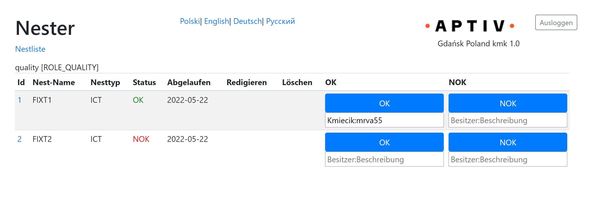
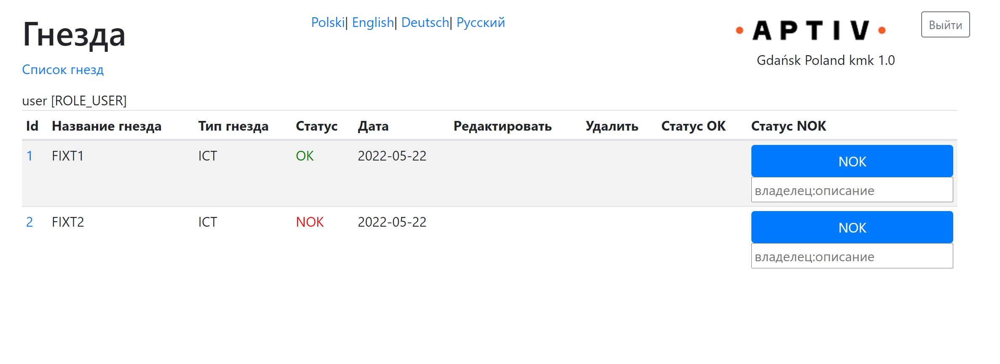
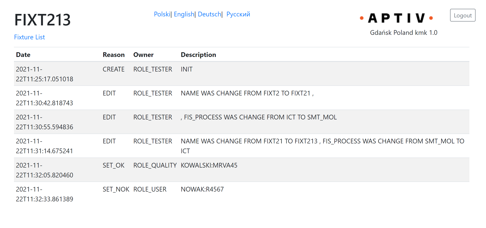
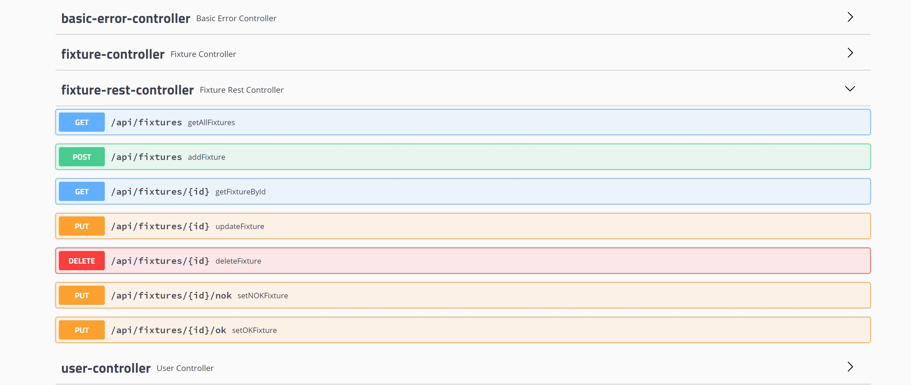

# Holistech

## Bussines requirements
There is a business need to have systemic possibility to block fixture on production floor.

## Project requirements
- [x] as a user with role TESTER/QUALITY/USER  I would like to log in to be able to block fixture in FIS
- [x] as a user with role TESTER/QUALITY/USER I would like to have recorded fixture status change or name  in history log and email
- [x] as a user with role TESTER/QUALITY/USER  I would like to see history log
- [x] as a user with role TESTER/QUALITY/USER  I would like to see fixture status
- [x] as a user with role TESTER/QUALITY/USER I would like to log in to be able to see status of fixture
- [x] as a user with role TESTER/QUALITY/USER I would like to have possibilities to choose languages Polski|English|Deutsch|Pyсский
- [x] as a user with role TESTER/QUALITY/USER I would like to use API for this
- [x] as a user with role TESTER/QUALITY/USER I would like to have 
- [x] as a user with role TESTER  I would like to login to be able as the only one to create new fixture (name and Type(ICT,SMT_MOL))
- [x] as a user with role QUALITY I would like to login to be able as the only one to unlock fixture in FIS

## Solution

### OpenPoints
- [x] FIS
- [x] email
- [x] Locale
- [x] Profiles
- [x] Inputs validation (frontend/backend)
- [x] Suggestion for inputs (SetOK,SetNOK,FixtureName)
- [x] Patterns for inputs (SetOK,SetNOK,FixtureName) 
- [x] Transfer inputs  to capital letters 
- [ ] Tests -> ongoing
- [X] REST API with Swagger UI
- [x] log history
- [ ] metrics Grafana
- [ ] Docker
- [ ] Holistech email -> canceled due to the IT Security  
- [ ] Holistech API -> waiting for IT feedback

### Used Technologies 
- SpringBoot (Spring Data, Spring Security)
- Thymeleaf with Bootstrap
- Swagger UI
